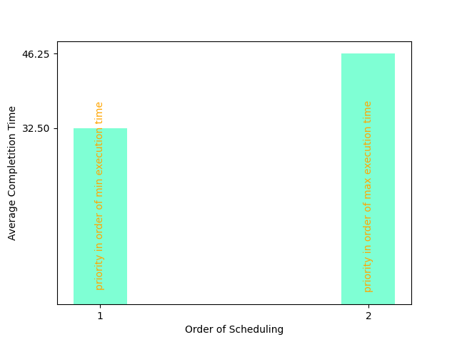
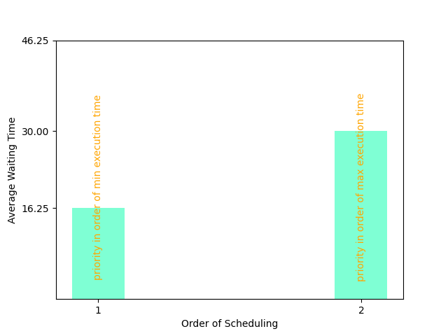

<h1>This is the 3rd assignment of OS(2024)</h1>

<h2>Shell</h2>
In this we have implemented the updated shell (with added functionality like & and adding processes) to the scheduler.

You can submit a process to be schedule with the syntax 
submit ./fib.out <priority>  
where prioirty is a number and it can be leaved blank too which would mean 1 by default. 

A process with higher priority value gets higher priority

<h2>How Have we implemented Scheduler?</h2>
1) We have created a priority queue, in which each process's pid, priority and shceduling time is sored. 
2) Higher priority means the process will be scheduled earlier. 
3) Scheduling time means that when the process was scheduled, this is to differentiate between processes of same priority with the process with a higher scheduling time to be scheduled for later. 
4) For this functionality of priority queue, a max heap has been made. Every time a process has to run the top element of heap is dequeued. 

<h3> How to run scheduler?</h3>
You can specify a time slice and ncpu. 
./scheduler.out <ncpu> <time_slcie> 
or by default ncpu is 1 and time slice is 10 ms 

After every time slice ncpu number of total number of processes (whichever is lower) in pq are dequeued and run by SIGCONT. After waking all of the process, the scheduler sleeps for time_slice amount of time. This avoids wasting of cpu cycles by the scheduler. 
After it wakes it interrupts all the wake processes by SIGSTOP (signal number 19) and all of them are stopped. And it again dequeues by the updated priorities and scheduling times and taking into account the new processes that come. 

<h2>How the shell communicated with the scheduler for new processes</h2>
We have implemented a shared memory by the name of "YOYO" and size 4096 bytes. In it every process stored two things, its pid and priority(1 by default) which is received by the scheduler 

<h2>Basic usage of the shell</h2>
echo jaat dont cheat

<h2> Statistics for completion time and waiting time for scheduler-></h2>
Cnnsider time slice to be 10ms, and 1 cpu 
Consider 4 processes with the following priority 
Process Name  Exec. Time   Priority 
p1            5ms          4 
p2            10ms         3 
p3            20ms         2 
p4            30ms         1 
 
or the other priority
 
p1            5ms          1 
p2            10ms         2 
p3            20ms         3 
p4            30ms         4 

THe graphs of completion time and waiting time for both the schemes are given resepctively (1 on x axis is upper scheme) 
 

  

  
These show that when processes which are lower in execution time are given higher priority the average waiting time and completion time <b>decreases</b>. And in the opposite case vice versa 

The execution time however obviously remains same for both schemes. 

Hence we should order processes of lower execution time higher priority for maximing the efficiency. This is usually done in MLFQs implemented in todays schedulers for OS. 

Thanks for Reading  
Vidush Jindal (2023592)  
Rahul Agarwal (2023418)
